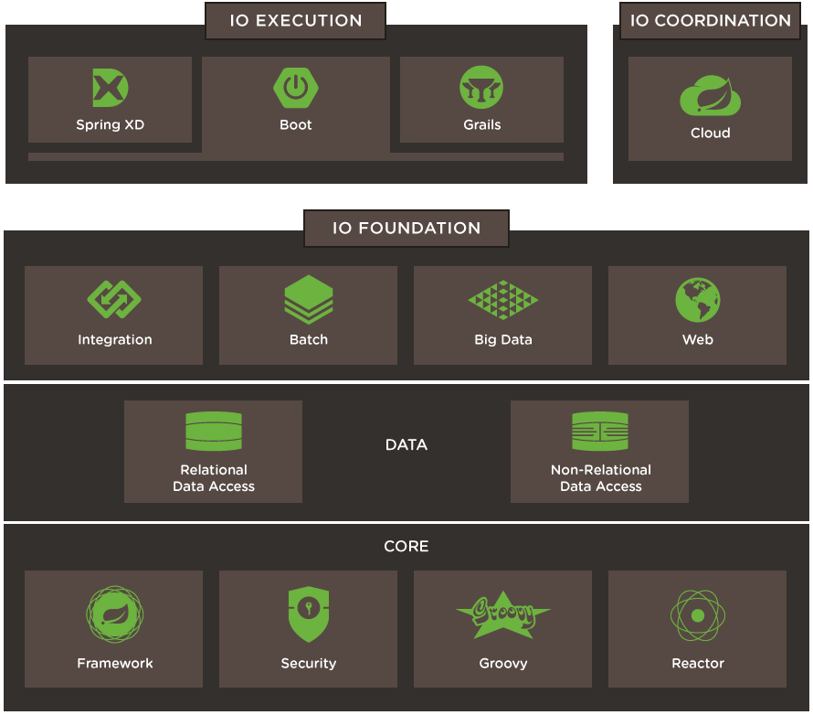

class: inverse, center, middle

# A Spring Framework 4.0 és 4.1 verzióinak újdonságai

HOUG Szakmai nap 2014 - 2014\. október

.card[
* .card-img[]
* Viczián István
* Java fejlesztő - [IP Systems](http://ipsystems.hu/)
* @vicziani at Twitter
* http://jtechlog.hu
]

---

# Környezet

* Pivotal
* Szoftverkomponensek és szolgáltatások adatközpontú és adatelemző 
  egyedi szoftverek agilis fejlesztésére felhő-alapú technológiákra építve
* EMC és General Electric
* Cloud Foundry, Redis, RabbitMQ, Grails, Groovy, Hadoop, stb.
* Konkurrencia: Amazon, Google, stb.

---

# Hype

big data, PaaS, agile development, cloud, ecosystem, mobile, visual analytics,
platform, framework, continuous delivery, no downtime, horizontally scaling, 
in memory, key-value store, open source, NoSQL, batch processing, enterprise integration patterns, 
reactive/event-driven application development

---

# Spring Framework

* Dependency Injection
* AOP
* Spring MVC webalkalmazások és RESTful webszolgáltatások fejlesztésére
* JDBC, JPA, JMS natív támogatása
* Automatizált tesztelés támogatása

---

# Spring IO Platform

.platform-stack-img[]

---

# Spring Framework

* 2013 december - [Spring 4.0 GA](http://spring.io/blog/2013/12/12/announcing-spring-framework-4-0-ga-release)
* 2014 szeptember - [Spring 4.1](https://spring.io/blog/2014/09/04/spring-framework-4-1-ga-is-here)
* Developer Productivity, Big Data, Cloud, REST és Micro Service Architecture

---

class: inverse, center, middle

# Spring 4

---

# Fejlesztés irányai

* Java 8
* Groovy
* Spring Boot (minimál konfiguráció, Ruby on Rails inspiráció)
* REST, RESTful, HATEOAS, micro service
* HTML5/WebSocket RFC 6455/JSR-356, STOMP

[Spring Framework Reference Documentation](http://docs.spring.io/spring/docs/current/spring-framework-reference/htmlsingle/)

[Juergen Hoeller: Webinar: Introduction to Spring Framework 4.0](https://www.youtube.com/watch?v=e4Jo_xJYcYg)

---

# Gyors belépés

* [spring.io](http://spring.io) oldal, [Project Sagan](https://github.com/spring-io/sagan)
* [start.spring.io](http://start.spring.io)
* Rövid útmutatók, tutorialok ([Guides](https://spring.io/guides))
* Spring Boot
* Maven "Bill Of Materials" [artifact](http://search.maven.org/#artifactdetails|org.springframework|spring-framework-bom|4.1.0.RELEASE|pom)

``` xml
<dependencyManagement>
    <dependencies>
        <dependency>
            <groupId>org.springframework</groupId>
            <artifactId>spring-framework-bom</artifactId>
            <version>4.1.0.RELEASE</version>
            <type>pom</type>
            <scope>import</scope>
        </dependency>
    </dependencies>
</dependencyManagement>
```

---

# Minimális futtatókörnyezet

* Java SE 6 update 18+ (~2010)
* Deprecated irtás
* 3rd party libraries: 3 éve létező verziók támogatása

---

# CGLIB proxy paraméter nélküli konstruktor

* CGLIB alapú proxy-knak nem kell paraméter nélküli konstruktor
 * [Objenesis](http://objenesis.org/) könyvtár segítségével, mely a Springhez csomagolt

---

# Paraméter nevek

* `@PathVariable` annotációnak paraméterként megadva
* Debug módban fordítás
* Java 8: `-parameters` kapcsoló [használata](http://docs.oracle.com/javase/tutorial/reflect/member/methodparameterreflection.html)

``` java
@RequestMapping(value="/owners/{ownerId}/pets/{petId}", method=RequestMethod.GET)
public String findPet(@PathVariable("ownerId") String ownerId, 
		@PathVariable("petId") String petId, Model model) {
    // ...
}
```

``` java
@RequestMapping(value="/owners/{ownerId}/pets/{petId}", method=RequestMethod.GET)
public String findPet(@PathVariable String ownerId, @PathVariable String petId, 
		Model model) {
    // ...
}
```

---

# Repetable annotációk

``` java
@Schedules({
	@Scheduled(cron = "0 0 12 * * ? *"),
	@Scheduled(cron = "0 0 18 * * ? *")
})
public void performJob() {
    // ...
}
```

``` java
@Scheduled(cron = "0 0 12 * * ? *")
@Scheduled(cron = "0 0 18 * * ? *")
public void performJob() {
    // ...
}
```

---

# Lambda kifejezések

``` java
JdbcTemplate jt = new JdbcTemplate(dataSource);

jt.query("select name, age from person where dep = ?",
	new PreparedStatementSetter() {
		void setValues(PreparedStatement ps) throws SQLException {
			ps.setString(1, "Sales");
		}
	},
	new RowMapper<Person>() {
		Person mapRow(ResultSet rs, int rowNum) throws SQLException {
			return new Person(rs.getString(1), rs.getInt(2);
		}
	}
);
```

``` java
jt.query("select name, age from person where dep = ?",
	ps -> ps.setString(1, "Sales"),
	(rs, rowNum) -> new Person(rs.getString(1), rs.getInt(2)));
```

---

# java.time támogatás

* Java 8: JSR-310, Java 6, 7: JodaTime
* Formatter SPI
* `Jsr310DateTimeFormatAnnotationFormatterFactory` osztály segítségével

``` java
@DateTimeFormat(iso = ISO.DATE)
private LocalDate localDate;

@DateTimeFormat(iso = ISO.TIME)
private LocalTime localTime;

@DateTimeFormat(iso = ISO.TIME)
private OffsetTime offsetTime;

@DateTimeFormat(iso = ISO.DATE_TIME)
private LocalDateTime localDateTime;

@DateTimeFormat(iso = ISO.DATE_TIME)
private ZonedDateTime zonedDateTime;

@DateTimeFormat(iso = ISO.DATE_TIME)
private OffsetDateTime offsetDateTime;
```

[Rafał Borowiec: Spring 4: @DateTimeFormat with Java 8 Date-Time API](http://blog.codeleak.pl/2014/06/spring-4-datetimeformat-with-java-8.html)

---

# Conditional Bean Definitions

* Beanek feltételes létrehozása
* Sokkal flexibilisebb megoldás, mint a profile-ok használata (az is ezzel van implementálva)
* Spring Boot

``` java
public class LinuxCondition implements Condition {
 
	@Override
	public boolean matches(ConditionContext context, 
			AnnotatedTypeMetadata metadata) {
		return context.getEnvironment().getProperty("os.name").contains("Linux");
	}
}

public class WindowsCondition implements Condition {
 
  @Override
  public boolean matches(ConditionContext context, 
		AnnotatedTypeMetadata metadata) {
    return context.getEnvironment().getProperty("os.name").contains("Windows");
  }
}
```

---

``` java
@Configuration
public class MyConfiguration {
 
  @Bean(name="emailerService")
  @Conditional(WindowsCondition.class)
  public EmailService windowsEmailerService(){
      return new WindowsEmailService();
  }
 
  @Bean(name="emailerService")
  @Conditional(LinuxCondition.class)
  public EmailService linuxEmailerService(){
    return new LinuxEmailService();
  }
}
```

[Jim White: Spring 4 – Conditional Bean Configuration](http://www.intertech.com/Blog/spring-4-conditional-bean-configuration/)

---

# Paraméterezhető meta-annotációkkal ellátott összetett annotációk

* Spring annotációk legtöbbje un. "meta-annotációként" is használható
* Saját összetett (composable) annotáció hozható létre: pl. saját komponensek tierenként
* Immár paraméterezhető is
 * Alapértelmezett paraméter átdefiniálására
 * Explicit megadás kikényszerítésére

---

``` java
@Target({ElementType.TYPE})
@Retention(RetentionPolicy.RUNTIME)
@Documented
@Scope("session")
public @interface SessionScope {

    ScopedProxyMode proxyMode() default ScopedProxyMode.DEFAULT

}
```

---

# Injektálás generikus típus alapján

* Spring Data

```java
@Service
public class BookService {

	@Autowired
	public BookService(Repository<Book> bookRepository) {
	}
}
```

---

# Groovy DSL

* GRails inspiráció

``` groovy
def reader = new GroovyBeanDefinitionReader(myApplicationContext)
reader.beans {
    dataSource(BasicDataSource) {
        driverClassName = "org.hsqldb.jdbcDriver"
        url = "jdbc:hsqldb:mem:grailsDB"
        username = "sa"
        password = ""
        settings = [mynew:"setting"]
    }
    sessionFactory(SessionFactory) {
        dataSource = dataSource
    }
    myService(MyService) {
        nestedBean = { AnotherBean bean ->
            dataSource = dataSource
        }
    }
}
```

---

# Apróságok

* `@Lazy` annotációval megadható, hogy lazy-init proxy legyen injektálva
* Tömbök vagy `List` esetén az injektált beanek sorrendje meghatározható: `Ordered` interfész, vagy `@Order` annotáció
* Időzóna kezelése a `LocaleContextResolver` és `TimeZoneAwareLocaleContext` interfészeken keresztül
* `@Description` annotáció a beanek leírására, pl. JMX kiajánláskor használatos

---

# Web

* Új `@RestController` annotáció, feleslegessé teszi a `@ResponseBody` annotáció használatát a `@RequestMapping` annotációval ellátott metódusokon

---

# AsyncRestTemplate

``` java
// async call
Future<ResponseEntity<String>> futureEntity = template.getForEntity(
    "http://example.com/hotels/{hotel}/bookings/{booking}", String.class, 
	"42", "21");

// get the concrete result - synchronous call
ResponseEntity<String> entity = futureEntity.get();
```

``` java
ListenableFuture<ResponseEntity<String>> futureEntity = template.getForEntity(
    "http://example.com/hotels/{hotel}/bookings/{booking}", String.class, 
	"42", "21");

// register a callback
futureEntity.addCallback(new ListenableFutureCallback<ResponseEntity<String>>() {
    @Override
    public void onSuccess(ResponseEntity<String> entity) {
        //...
    }

    @Override
    public void onFailure(Throwable t) {
        //...
    }
});
```

---

# WebSocket, SockJS

* Full-duplex kétirányú kommunikáció
* Lehetővé teszi az aszinkron, eseményvezérelt, üzenetalapú architektúra kialakítását
* `spring-websocket` modul
* JSR-356 szabványra épül (Java EE 7 része)
* [SockJS](http://sockjs.org/) fallback
 * WebSocket API WebSocket-et nem támogató környezetekbe (pl. régi böngésző, tűzfal)
 * WebSocket, Streaming, polling
* `WebSocketHandler` és leszármazottai, `TextWebSocketHandler` vagy `BinaryWebSocketHandler`

---

# STOMP

* Magasabb szintű protokoll, mint a WebSocket
 * Üzenetformátum
 * Minták
* `spring-messaging` modul
* Spring MVC-hez hasonló programozási model (annotáció alapú)
* Spring Integrationből ismert absztrakciók, mint `Message`, `MessageChannel`, `MessageHandler`

[Using WebSocket to build an interactive web application](http://spring.io/guides/gs/messaging-stomp-websocket/)

---

# Teszt

* Már a test context frameworkben is használhatóak összetett annotációk
* `SocketUtils` nyitott portok felderítésére localhoston
 * Integrációs teszthez saját SMTP, FTP és web konténer indítására
* Profile beállítása programozottan `ActiveProfilesResolver` használatával

---

# Java EE

* Java EE 6+ 
* Servlet 3.0
 * De kompatiblilis a 2.5 szabvánnyal is, pl. Google App Engine miatt
* JMS 2.0
* JPA 2.1
* Bean Validation 1.1

---

class: inverse, center, middle

# Spring 4.1

---

# JMS

* `@JmsListener` annotáció

``` java
@Component
public class MyService {

    @JmsListener(destination = "myDestination")
    public void processOrder(String data) { ... }
}
```

* `spring-messaging` absztrakció
* `JmsTemplate` támogatja a szinkron kérés-válasz kommunikációt

---

# Caching

* JCache (JSR-107) annotációk - majd a Java EE 8-ban
* Cserélhető implementációk: JDK `ConcurrentHashMap`, EhCache, Guava Cache, GemFire, JSR-107 Cache

``` java
@CacheResult(cacheName="books")
public Book findBook(@CacheKey ISBN isbn, boolean checkWarehouse, 
	boolean includeUsed)
```

---

# Web

* `Optional` metódus paraméterek
* Statikus erőforrások feloldása és transzformációja
* Három új `HttpMessageConverter`: Gson, Google Protocol Buffers, Jackson XML szerializáció
* Deklaratív view feloldás
* Groovy markup template, mint view réteg
* View rétegben képes az URL-t összeállítani a Controller és metódusának megadásával

---

# Statikus erőforrások kezelése

* `ResourceResolver` és `ResourceTransformer` láncok, `ResourceUrlProvider`
* Felhasználási példák
 * Tömörítés (gzip)
 * Minify, concatenate
 * HTTP caching
 * Verziószám beillesztése

``` java
@Configuration
@EnableWebMvc
public class WebConfig extends WebMvcConfigurerAdapter {

    @Override
    public void addResourceHandlers(ResourceHandlerRegistry registry) {
        registry.addResourceHandler("/resources/**")
			.addResourceLocations("/public-resources/")
			.setCachePeriod(31556926);
    }

}
```

---

# Tesztelés

* `@TestPropertySource` melynek magas precedenciája van
* `@Sql` annotáció adatbázis előkészítéséhez integrációs teszteléskor

---

# Teljesítmény

* SpEL kifejezések futásidejú bájtkóddá fordítása
