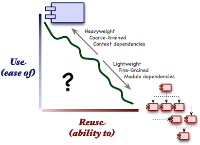
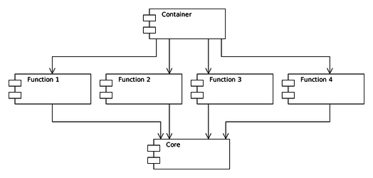

class: inverse, center, middle

# Modularizáció Servlet 3, Spring és Maven környezetben

HWSW free! Java meetup - 2015. augusztus

.card[
* .card-img[]
* Viczián István
* Java fejlesztő - [IP Systems](http://ipsystems.hu/)
* @vicziani at Twitter
* http://jtechlog.hu
]

---

# Miről lesz szó?

* Modulok szükségessége
* Modulok fogalma
* Modul tervezési minták
* Eszköztámogatás, mint Servlet 3, Spring és Maven

---

# Modul szükségessége

* Interfészek és osztályok finom szemcsézettségűek, újrafelhasználhatóságuk 
magas, nehezebben használhatóak
* Alkalmazások, szolgáltatások szemcsézettsége durva, újrafelhasználhatóságuk
alacsony, könnyebben használhatóak
* Újrafelhasználhatóság növelésével nő a komplexitás



---

# Modul tulajdonságai

* Deployable: külön telepíthető
* Manageable
 * Futás közben: külön indítható, leállítható
 * Fejlesztés közben: külön buildelhető, release-elhető, külön fejleszthető
* Testable: külön tesztelhető
* Natively reusable: metódushívással
* Composable: több modulból egy modul hozható létre
* Stateless unit: nem példányosítható, nincs állapota (az osztályokkal ellentétben)
* Concise interface: tömör interfész a használói számára

---

## OO alapok

* High cohesion
* Low coupling
* Single reposibility principle
* Well-defined interface

---

# Modul fogalma

* Java platformon nem más, mint a JAR állományok!


[Kirk Knoernschild: Java Application Architecture](http://www.amazon.com/Java-Application-Architecture-Modularity-Patterns/dp/0321247132)

---

# Modul mint fejlesztési egység

* Az architektúra tükrözi a szervezeti felépítést
* Conway törvénye
* Kis létszámú agilis csapatok hajlamosabbak modularizált alkalmazás fejlesztésére
* Komplexitás csökkentése
* Konfliktusok minimalizálása
* Felelősség egysége
* Modul interfész egyben a csapatok közötti interfész
* Újrafelhasználhatóság?

---

# Microservices

* Ígéretek
 * Külön fejleszhető 
 * Külön tesztelhető
 * Külön telepíthető
 * Skálázható
 * Refaktorálható, cserélhető, akár teljesen eltérő nyelven, platformon, architektúrával
* Ha a monolitikus alkalmazásod sem felel meg az oo alapelveknek, akkor nem segít
* Új problémákat vezet be: latency, message serialization, fault tolerance, unreliable networks, versioning
* Komplexitás ugyanúgy megvan, csak áthelyezted máshova (operational)

---

# Javasolt irány: robbanthatóság

* Továbblépni, csak ha szükséges:
 * Csomag alapú szeparáció
 * Külön JAR modulok
 * Microservices
* Hasonlat: dokumentumkezelés


---

# Tervezett modul függőségek

* Az architektúra jelenjen meg a kódban - [Coding The Architecture](http://www.codingthearchitecture.com/) - Simon Brown
 * Jelenjen meg a csomagokban
 * Jelenjen meg a `pom.xml`-ekben

---

# Tervezett modul függőségek - csomag szinten

* [JDependdel](http://www.clarkware.com/software/JDepend.html) tesztesetként 
definiálhatók a csomagok közti függőségek, és ellenőrzi ezek megsértését

``` java
DependencyConstraint constraint = new DependencyConstraint();

JavaPackage repository = constraint.addPackage("jtechlog.funct1.repository");
JavaPackage service = constraint.addPackage("jtechlog.funct1.service");
JavaPackage controller = constraint.addPackage("jtechlog.funct1.controller");

controller.dependsUpon(service);
service.dependsUpon(controller);

jdepend.analyze();

assertEquals("Dependency mismatch",
         true, jdepend.dependencyMatch(constraint));
```

---

# Tervezett modul függőségek - Maven dependency szinten

* UML diagram

```
mvn dependency:tree

mvn dependency:analyze
```

---

# Modulok szintekhez rendelése

* Legalacsonyabb szint: core module
* Közbülső szint: functional modules
* Legmagasabb szint: container module
* Egymás után buildelendő, több szint bonyolítja a build folyamatot



---

# Core module

* Minden modulban újrafelhasználható komponensek
* Ide kerülnek az interfészek és default implementációk
* Ide kerülnek az események

---

# Funkcional module

* Üzleti funkciókat tartalmazza
* Speciális
 * Infrastruktúra
 * Kommunikációs
* Önmagában, a többi modul nélkül indítható

---

# Container modul

* Servlet 3.0 web fragment
* [WebJars](http://www.webjars.org/)
* Erőforrások a `META-INF/resources` könyvtárban
* Maven WAR overlay elkerülése
* Ebben kötelezően tesztelendő
* Csak ezt és a fejlesztett functional modult kell újrafordítani

---

# Spring DI

``` java
public interface Module {
  
	public String getName();

    public String getVersion();

}
```

``` java
@Component
public ModuleContainer {

	@Autowired
	public List<Module> modules;

	public ModuleContainer(List<Module> modules) {
		this.modules = modules;
	}

}
```

---

# Modulok kialakítása fizikai rétegek alapján

* Layerek fogalma
* Full stack developer
* Vágás funkciónként, csak azon belül layerenként
* Implementációs részlet?
* Lehet, technológiai kényszer külön projektként a frontendet
* Multimodule Maven project
* Maven prototype
* Spring ApplicationContext hierarchy

---

# Spring ApplicationContext hierarchy

``` xml
<context-param>
    <param-name>contextConfigLocation</param-name>
    <param-value>
        classpath:/spring/applicationContext.xml
    </param-value>
</context-param>

<listener>
    <listener-class>org.springframework.web.context.ContextLoaderListener
		</listener-class>
</listener>

<servlet>
    <servlet-name>dispatcher</servlet-name>
    <servlet-class>org.springframework.web.servlet.DispatcherServlet
		</servlet-class>
    <init-param>
        <description></description>
        <param-name>contextConfigLocation</param-name>
        <param-value>classpath:/spring/dispatcher-servlet.xml</param-value>
    </init-param>
    <load-on-startup>1</load-on-startup>
</servlet>
```

---

# Adatbázis

* Minden modulnak saját adatbázisa (tábla nevei modul prefix-szel)
* JPA probléma a `persistence.xml` állománnyal

``` java
entityManagerFactoryBean.setPackagesToScan("jtechlog");
```

* Saját maga inicializálja (pl. [Flyway](http://flywaydb.org/))

``` java
for (Module module: modules) {
    Flyway flyway = new Flyway();
    flyway.setDataSource(dataSource);
    flyway.setLocations(computeLocations(databaseType, 
		module.migrationPathPrefix()));
    flyway.setTable(module.schemaVersionTableName());
    flyway.setInitOnMigrate(true);
    flyway.migrate();
}
```

---

# Konténerfüggetlenség

* Könnyebben tesztelhető
* Könnyebben portolható
* Dependency Injection: Spring XML vagy Java config
* Non-invasive

---

# Modulonként külön konfiguráció

* XML-ben classpath-ról felolvasás

``` xml
<context-param>
    <param-name>contextConfigLocation</param-name>
    <param-value>
        classpath*:conf/**/appContext.xml
    </param-value>
</context-param>

```

* Java-ban component scan: 

``` java
@ComponentScan("jtechlog.**.config")`
```

* Convention over configuration

``` java
@ComponentScan({"jtechlog.**.repository",
        "jtechlog.**.service",
        "jtechlog.**.controller"})
```

---

# Független konfiguráció

* A konfiguráció mindig a környezet része
* Spring Boot: [Externalized Configuration](http://docs.spring.io/spring-boot/docs/current/reference/html/boot-features-external-config.html)
* A Spring [Unified Property Management](http://spring.io/blog/2011/02/15/spring-3-1-m1-unified-property-management/) áll a háttérben (`Environment`, `PropertySource`)

---

# Publikált interfész

* Két megoldás
 * Szinkron hívás interfészeken keresztül
 * Eseménykezelés
* Standard Java-ban nincs rá megoldás
 * OSGi service interface és implementation különválasztása (`Manifest.mf` állományban `Export-Package`)
 * Project Jigsaw `module-info.java`
 * Spring Dynamic Modules: Pivotal átadta az Eclipse-nek
 * Impala: Dynamic modules for Spring-based app., 2013 óta áll
 * SpringSource dm Server: átadva az Eclipse-nek
 * Eclipse Virgo: utolsó kiadás 2014 július
* Robbantásnál figyelni: metódus paraméterének módosítása nincs visszahatással (pass-by-value?)

---

# Project Jigsaw

``` java
module com.greetings @ 0.1 {
    requires jdk.base; // default to the highest available version
    requires org.astro @ 1.2;
    class com.greetings.Hello;
	exports com.greetings;
}
```

---

# Spring eseménykezelés

``` java
@Component
public class MyHandlerComponent {
  
  @EventListener(condition = "#creationEvent.awesome")
  public void handleOrderCreatedEvent(CreationEvent<Order> creationEvent) {
    ... 
  }

}

@Component
public class MyPublisherComponent {

    private final ApplicationEventPublisher publisher;
    
    @Autowired
    public MyComponent(ApplicationEventPublisher publisher) { ... }
    
    public void createOrder(Order order) {
        // ....
        this.publisher.publishEvent(new OrderCreatedEvent(order)); 
    }

}
```

---

# Implementáció példányosító

Springben a defininált beanek felülírhatóak.

``` xml
<bean id="helloWorld" class="jtechlog.HelloWorld" />
```

``` xml
<bean id="helloWorld" class="jtechlog.HelloWorldOverride" />
```

```
INFO: Overriding bean definition for bean 'helloWorld': replacing [Generic be
an: class [jtechlog.HelloWorld]; scope=si
ngleton; abstract=false; lazyInit=false; autowireMode=0; dependencyCheck=0; auto
wireCandidate=true; primary=false; factoryBeanName=null; factoryMethodName=null;
 initMethodName=null; destroyMethodName=null] with [Generic bean: class 
[jtechlog.HelloWorldOverride]; scope=singleton; abstract=false; lazyInit=false; 
autowireMode=0; dependencyCheck=0; autowire
Candidate=true; primary=false; factoryBeanName=null; factoryMethodName=null; ini
tMethodName=null; destroyMethodName=null]
```

---

# Absztrakt elemek külön modulban

* Lehetőségek:
 * Core modul
 * Funkcionális modulonként külön almodul
 * Funkcionális modul attached artifact

---

# Maven attached artifact

``` xml
<plugin>
    <groupId>org.apache.maven.plugins</groupId>
    <artifactId>maven-jar-plugin</artifactId>
    <version>2.6</version>
    <executions>
      <execution>
        <phase>package</phase>
        <goals>
          <goal>jar</goal>
        </goals>
        <configuration>
          <classifier>client</classifier>
          <includes>
            <include>**/service/*</include>
          </includes>
        </configuration>
      </execution>
    </executions>
</plugin>
```

---

# Teszt modul

* Funkcionális modul almodulja
* Konténer modulban funkcionális modulokon átnyúló integrációs tesztek
* Maven: nincs primary artifact
* Interfészen keresztül
* Spring ApplicationContext cache

---

# Összefoglalás

* Objektumorientált elvek használata
* Csomagokkal szervezett monolitikus alkalmazással induljunk
* Később robbanthatunk
* Maven, Spring támogatja a modularizációs tervezési mintákat
